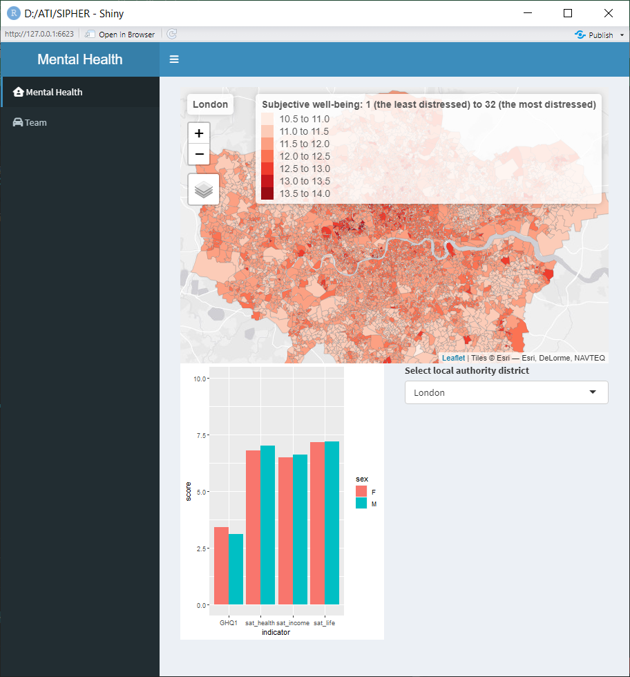
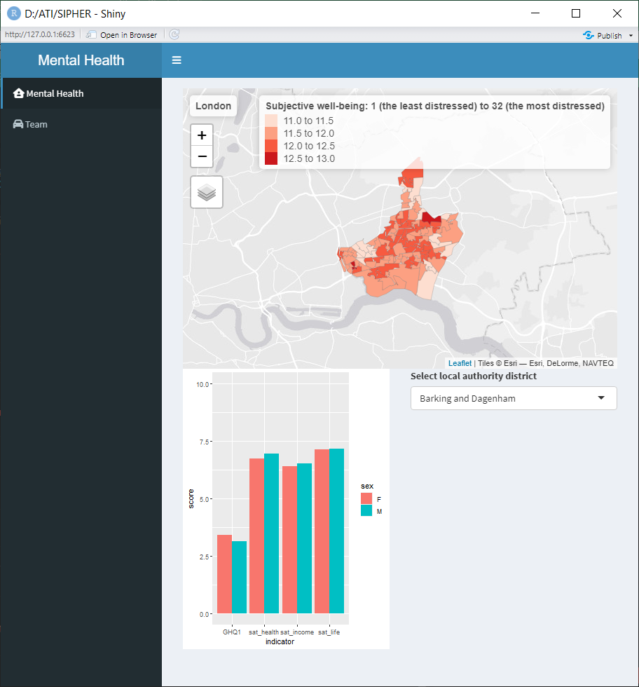
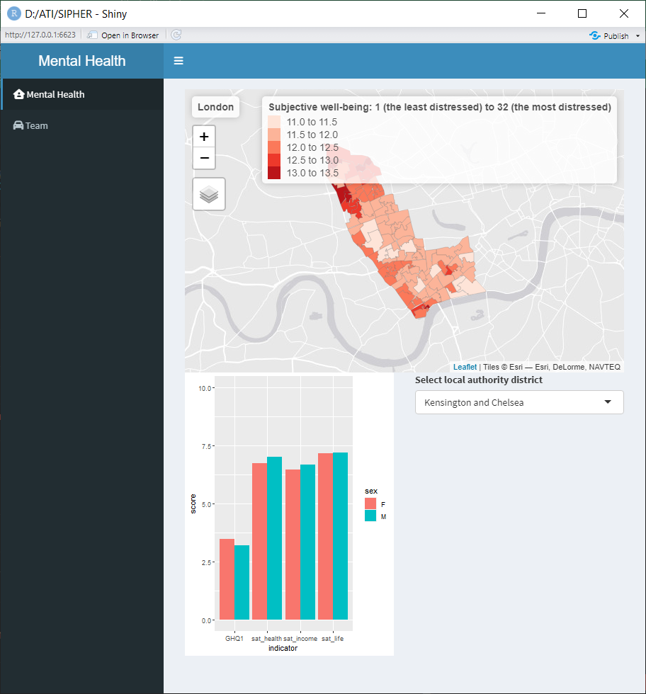

# Mental Health Dashboard

This project is intended to produce a mental health dashboard that allows policy stakeholders to visualise and explore small-area estimates of self-reported mental well-being.

Programming language: R

## Example visualisations
### GHQ scores in London by LSOA 
### GHQ scores in London Barking by LSOA 
### GHQ scores in London Kensington & Chelsea by LSOA 
